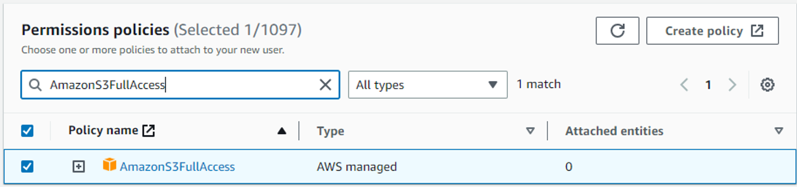
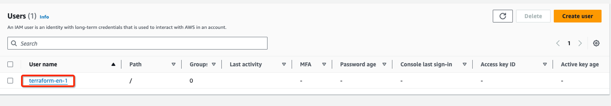
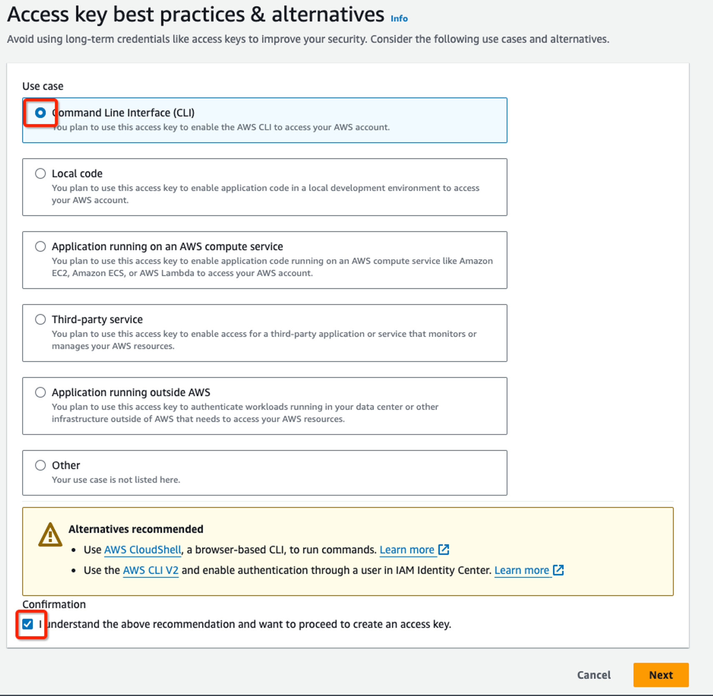
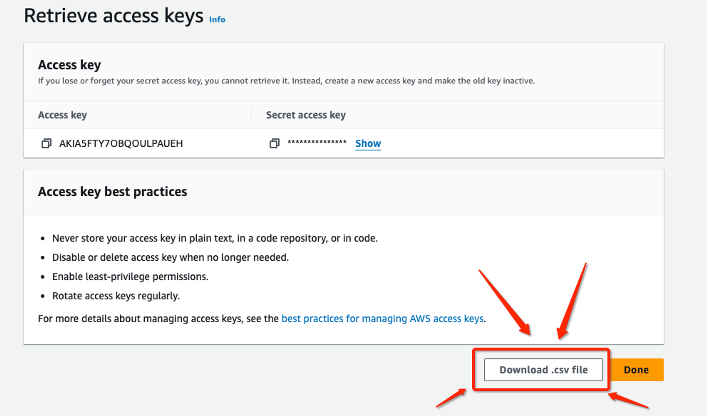
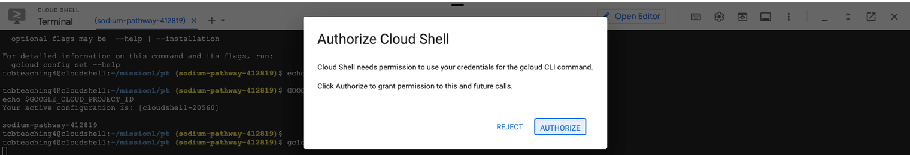

# MultiCloud Deployment and Application Migration

This repository documents the steps and processes involved in provisioning infrastructure, containerizing applications, and executing a professional cloud migration across AWS and GCP using Terraform, Docker, Kubernetes, Amazon S3, and Google Cloud SQL.

## Table of Contents
1. [Infrastructure Provisioning](#infrastructure-provisioning)
2. [Application Containerization and Deployment](#application-containerization-and-deployment)
3. [Cloud Migration and Database Management](#cloud-migration-and-database-management)


## Infrastructure Provisioning
### Steps in Amazon Web Services (AWS)
#### Creating the terraform-en-1 user using the IAM service

- Access the AWS console ([https://aws.amazon.com](https://aws.amazon.com/)) **and log in with your newly created account**. In the search bar, type IAM. In the Services section, click on IAM.
- Click on Users and then Add users, enter the name **terraform-en-1** and click Next to create a programmatic type user.


- After advancing, in Set permissions, click on the Attach existing policies directly button.
- Type **AmazonS3FullAccess** in **Search.**
- Select **AmazonS3FullAccess**

- Click on **Next**
- Review all the details
- Click on **Create user**
#### Creating the Access Key for the terraform-en-1 user using the IAM service


- Click on the Security credentials tab

- Access the **terraform-en-1** user
- Navigate to the **Access keys** section
- Click on **Create access key**


- Select Command Line Interface (CLI) and I understand the above recommendation and want to proceed to create an access key.

- Click on **Next**.
- Click on **Create access key**

- Click on Download .csv file
- Once the download is complete, rename the .csv file to key.csv.

### Steps in Google Cloud Platform (GCP)

#### Preparing the environment to run Terraform

- Access the Google Cloud Console ([console.cloud.google.com](http://console.cloud.google.com/)) **and log in with your newly created account**


- Download the mission1.zip file in the Google Cloud shell using the wget command
- 
- 
- Upload the key.csv file to the Cloud Shell using the browser
- 
- Open the Cloud Shell
- Verify if the mission1.zip and key.csv files are in the folder in the Cloud Shell using the command below
```
ls

```
```
unzip mission1.zip

```

```
mv key.csv mission1/en

```

```
cd mission1/en

```

```
chmod +x *.sh

```
- Execute the commands below to prepare the AWS and GCP environment
    
    ```
    mkdir -p ~/.aws/
    
    ```
    
    ```
    touch ~/.aws/credentials_multiclouddeploy
    
    ```
    
    ```
    ./aws_set_credentials.sh key.csv
    
    ```
    
    ```
    GOOGLE_CLOUD_PROJECT_ID=$(gcloud config get-value project)
    
    ```
    
    ```
    gcloud config set project $GOOGLE_CLOUD_PROJECT_ID
    
    ```
    
- Click on Authorize


- Execute the command below to set the project in the Google Cloud Shell
./gcp_set_project.sh

​
- Execute the commands to enable the Kubernetes, Container Registry, and Cloud SQL APIs
```
gcloud services enable containerregistry.googleapis.com

```

```
gcloud services enable container.googleapis.com

```

```
gcloud services enable sqladmin.googleapis.com

```

```
gcloud services enable cloudresourcemanager.googleapis.com
```

```
gcloud services enable serviceusage.googleapis.com
```

```
gcloud services enable compute.googleapis.com
```

```
gcloud services enable servicenetworking.googleapis.com --project=$GOOGLE_CLOUD_PROJECT_ID
```
**Attention**: The provisioning process can take between **15 to 25 minutes** to finish. Keep the **CloudShell** open during the process. If disconnected, click on **Reconnect** when the session expires (the session expires after **5 minutes** of inactivity by default)

# Security Tips

- For production environments, it's recommended to use only the Private Network for database access.
- Never provide public network access (0.0.0.0/0) to production databases. ⚠️

This README file provides a comprehensive and detailed guide to implementing the project, covering all major steps and specific tasks involved.
