# MultiCloud Deployment and Application Migration

This repository documents the steps and processes involved in provisioning infrastructure, containerizing applications, and executing a professional cloud migration across AWS and GCP using Terraform, Docker, Kubernetes, Amazon S3, and Google Cloud SQL.

## Table of Contents

1. [Infrastructure Provisioning](#infrastructure-provisioning)
2. [Application Containerization and Deployment](#application-containerization-and-deployment)
3. [Cloud Migration and Database Management](#cloud-migration-and-database-management)

## Cloud Architecture

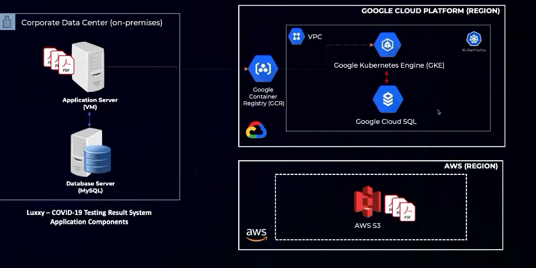

## Infrastructure Provisioning

### Steps in Amazon Web Services (AWS)

#### Creating the terraform-en-1 user using the IAM service

- Access the AWS console ([https://aws.amazon.com](https://aws.amazon.com/)) **and log in with your newly created account**. In the search bar, type IAM. In the Services section, click on IAM.
- Click on Users and then Add users, enter the name **terraform-en-1** and click Next to create a programmatic type user.

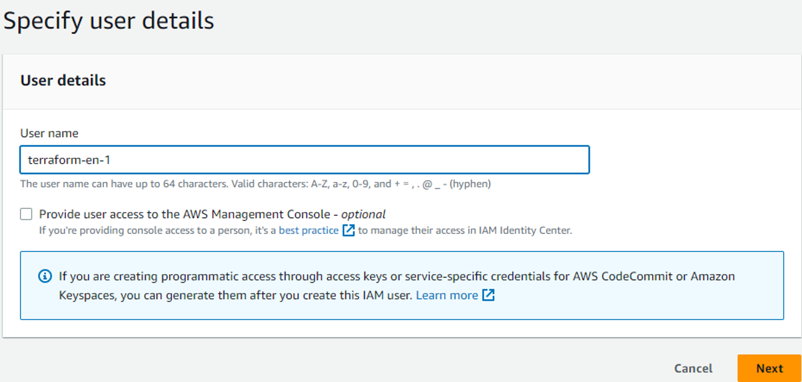

- After advancing, in Set permissions, click on the Attach existing policies directly button.
- Type **AmazonS3FullAccess** in **Search.**
- Select **AmazonS3FullAccess**
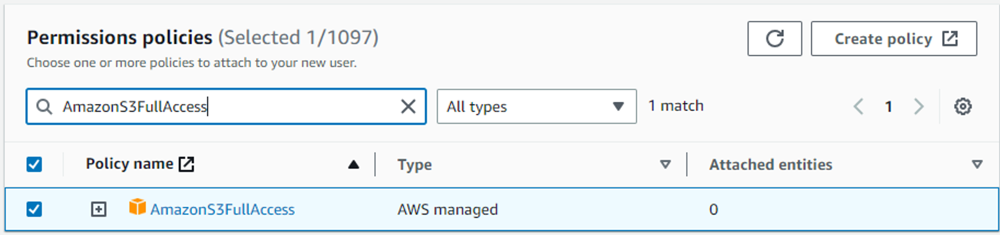
- Click on **Next**
- Review all the details
- Click on **Create user**

#### Creating the Access Key for the terraform-en-1 user using the IAM service

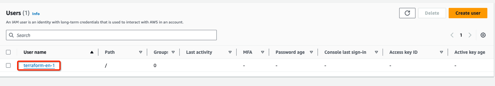

- Click on the Security credentials tab

- Access the **terraform-en-1** user
- Navigate to the **Access keys** section
- Click on **Create access key**

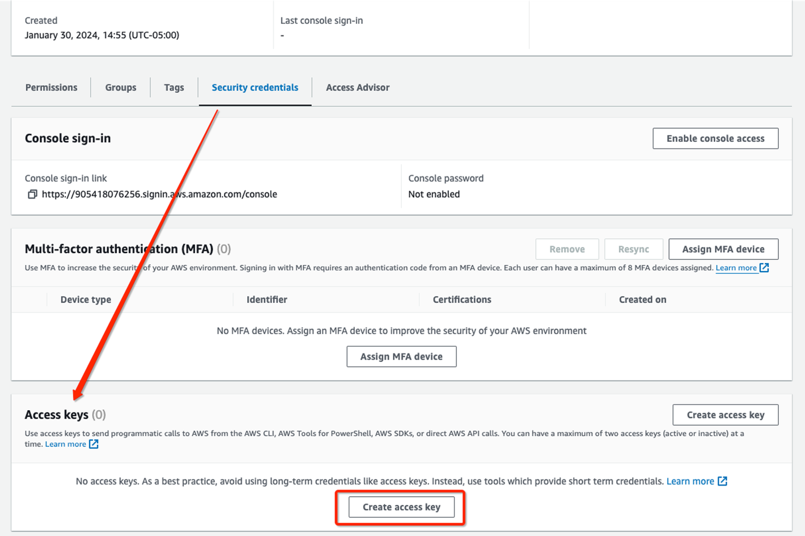

- Select Command Line Interface (CLI) and I understand the above recommendation and want to proceed to create an access key.
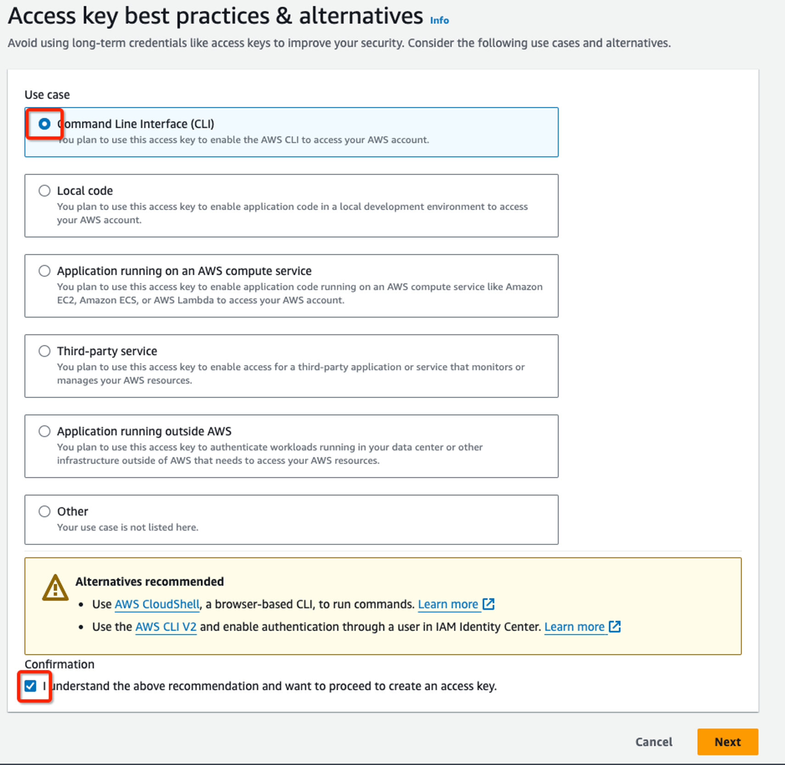
- Click on **Next**.
- Click on **Create access key**
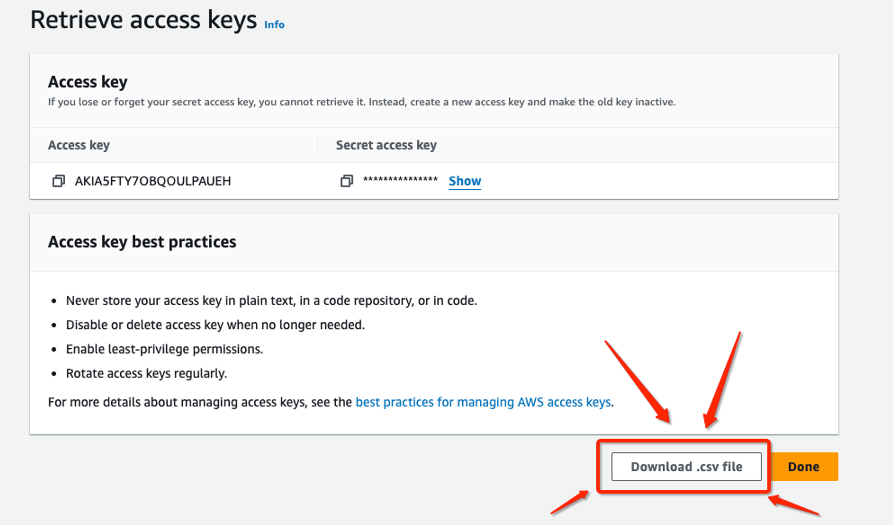
- Click on Download .csv file
- Once the download is complete, rename the .csv file to key.csv.

### Steps in Google Cloud Platform (GCP)

#### Preparing the environment to run Terraform

- Access the Google Cloud Console ([console.cloud.google.com](http://console.cloud.google.com/)) **and log in with your newly created account**

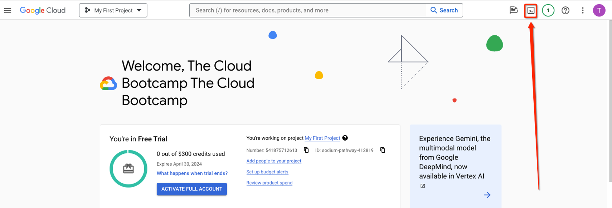

- Download the mission1.zip file in the Google Cloud shell using the wget command
 
- 
- Upload the key.csv file to the Cloud Shell using the browser

```bash
wget missions/mission3.zip
```

- Open the Cloud Shell
- Verify if the mission1.zip and key.csv files are in the folder in the Cloud Shell using the command below
```
ls

```
```
unzip mission1.zip

```

```
mv key.csv mission1/en

```

```
cd mission1/en

```

```
chmod +x *.sh

```
- Execute the commands below to prepare the AWS and GCP environment
    
    ```
    mkdir -p ~/.aws/
    
    ```
    
    ```
    touch ~/.aws/credentials_multiclouddeploy
    
    ```
    
    ```
    ./aws_set_credentials.sh key.csv
    
    ```
    
    ```
    GOOGLE_CLOUD_PROJECT_ID=$(gcloud config get-value project)
    
    ```
    
    ```
    gcloud config set project $GOOGLE_CLOUD_PROJECT_ID
    
    ```
    
- Click on Authorize


- Execute the command below to set the project in the Google Cloud Shell
./gcp_set_project.sh

​
- Execute the commands to enable the Kubernetes, Container Registry, and Cloud SQL APIs
```
gcloud services enable containerregistry.googleapis.com

```

```
gcloud services enable container.googleapis.com

```

```
gcloud services enable sqladmin.googleapis.com

```

```
gcloud services enable cloudresourcemanager.googleapis.com
```

```
gcloud services enable serviceusage.googleapis.com
```

```
gcloud services enable compute.googleapis.com
```

```
gcloud services enable servicenetworking.googleapis.com --project=$GOOGLE_CLOUD_PROJECT_ID
```
**Attention**: The provisioning process can take between **15 to 25 minutes** to finish. Keep the **CloudShell** open during the process. If disconnected, click on **Reconnect** when the session expires (the session expires after **5 minutes** of inactivity by default)

### Security Tips

- For production environments, it's recommended to use only the Private Network for database access.
- Never provide public network access (0.0.0.0/0) to production databases. ⚠️
## Application Containerization and Deployment
### Steps in Amazon Web Services (AWS)
- Access AWS console and go to IAM service
- Under Access management, Click in "Users", then "Add users". Insert the User name **luxxy-covid-testing-system-en-app1** and click in **Next** to create a programmatic user.
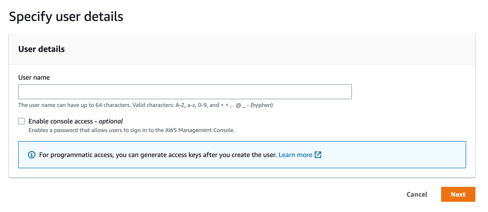
- On Set permissions, Permissions options, click in "Attach policies directly" button.
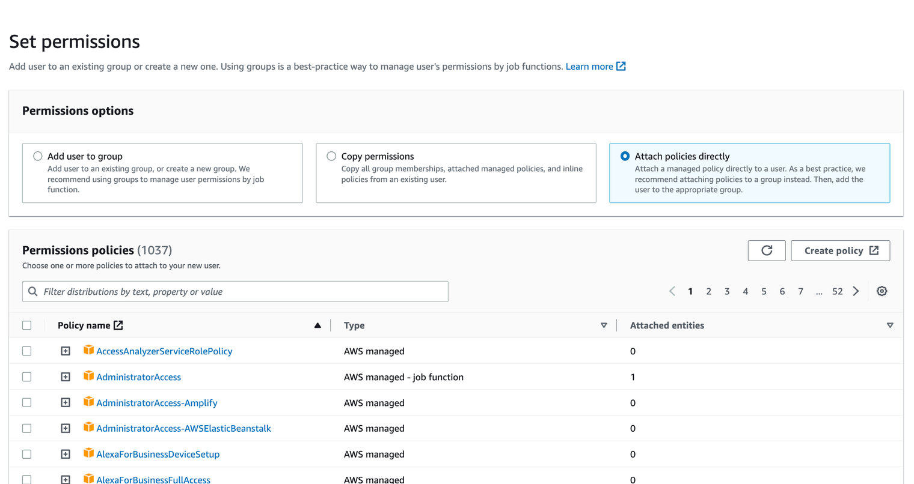
- Type **AmazonS3FullAccess** in **Search**.
- Select **AmazonS3FullAccess**
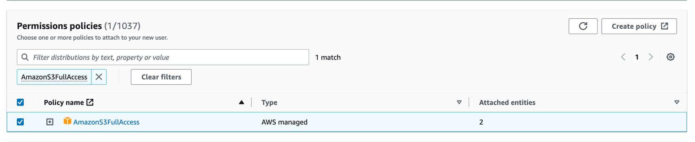
- Click in **Next**
- Review all details and click in Create user
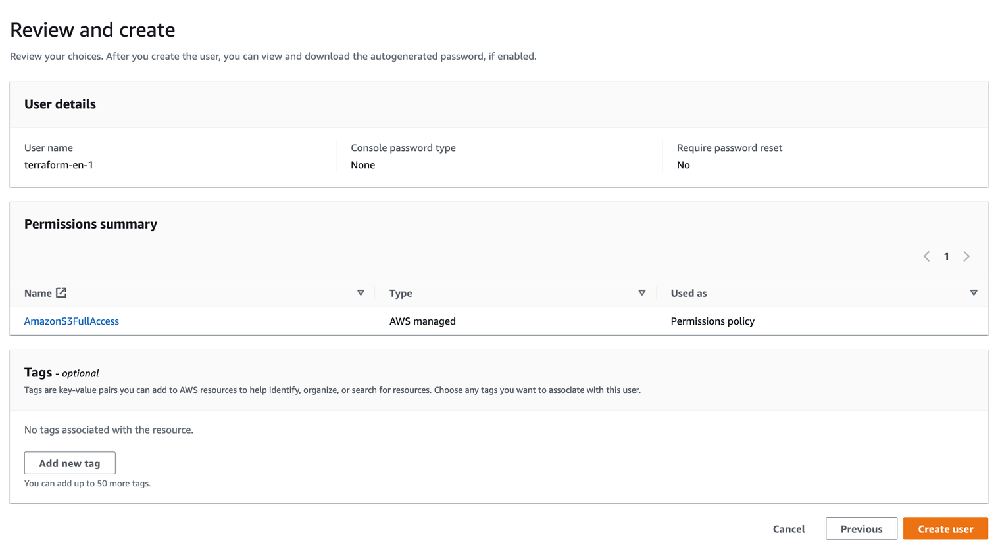

#### **Steps to create access key:**

- Click on the user you have created.
- Go to Security credentials tab.
- Scroll down and go to Access keys section.
- Click on Create access key
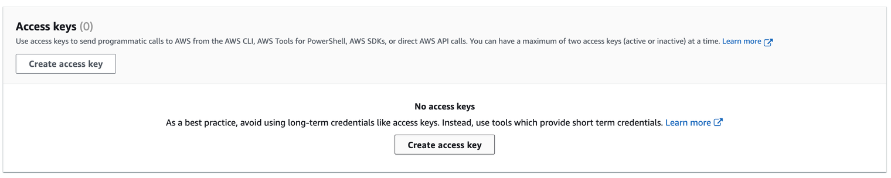
- Select **Command Line Interface (CLI)** and **I understand the above recommendation and want to proceed to create an access key** checkbox.
- Click Next
- Click on Create access key
- Click on Download .csv file
- After download, click Done.
- Now, rename .csv file downloaded to **luxxy-covid-testing-system-en-app1.csv**

### Steps in Google Cloud Platform (GCP)

- Navigate to Cloud SQL instance and create a new user **app** with password **welcome123456** on Cloud SQL MySQL database
- Connect to Google Cloud Shell
- **Download** the mission2 files to Google Cloud Shell using the wget command as shown below

```bash
cd ~
```

```bash
**wget https://tcb-public-events.s3.amazonaws.com/icp/mission2.zip**
```

```bash
unzip mission2.zip
```

- Connect to MySQL DB running on Cloud SQL (once it prompts for the password, provide welcome123456). Don’t forget to replace the placeholder with your Cloud SQL Public IP
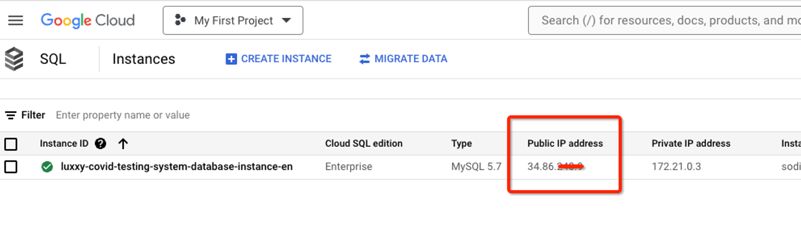

```bash
mysql --host=<replace_with_public_ip_cloudsql> --port=3306 -u app -p
```

Once you're connected to the database instance, create the products table for testing purposes

This README file provides a comprehensive and detailed guide to implementing the project, covering all major steps and specific tasks involved.

```bash
use dbcovidtesting;
```

```bash
source ~/mission2/en/db/create_table.sql
```

```bash
show tables;
```

```bash
exit;
```

- Enable Cloud Build API via Cloud Shell.
gcloud services enable cloudbuild.googleapis.com
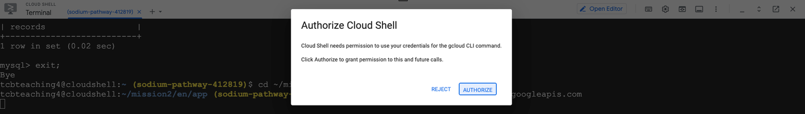
- Build the Docker image and push it to Google Container Registry.

```bash
GOOGLE_CLOUD_PROJECT_ID=$(gcloud config get-value project)
```

```bash
cd ~/mission2/en/app
```

```bash
gcloud builds submit --tag gcr.io/$GOOGLE_CLOUD_PROJECT_ID/luxxy-covid-testing-system-app-en
```

- Open the Cloud Editor and edit the Kubernetes deployment file (luxxy-covid-testing-system.yaml) and update the variables below on line 33 in red with your <PROJECT_ID> on the Google Container Registry path, on line 42 AWS Bucket name, AWS Keys (open file luxxy-covid-testing-system-en-app1.csv and use Access key ID on line 44 and Secret access key on line 46)  and Cloud SQL Database Private IP on line 48.
cd ~/mission2/en/kubernetes
luxxy-covid-testing-system.yaml

				image: gcr.io/<PROJECT_ID>/luxxy-covid-testing-system-app-en:latest
...
				- name: AWS_BUCKET
          value: "luxxy-covid-testing-system-pdf-en-xxxx"
        - name: S3_ACCESS_KEY
          value: "xxxxxxxxxxxxxxxxxxxxx"
        - name: S3_SECRET_ACCESS_KEY
          value: "xxxxxxxxxxxxxxxxxxxx"
        - name: DB_HOST_NAME
          value: "172.21.0.3"

- Connect to the GKE (Google Kubernetes Engine) cluster via Console

#### Step 1

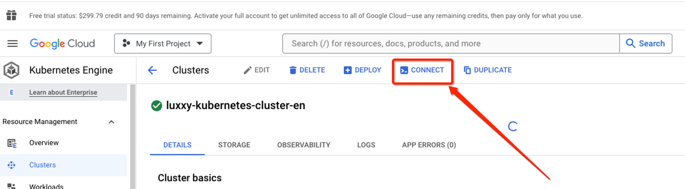

#### Step 2

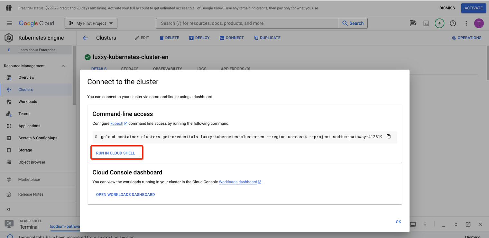

- Deploy the application Luxxy in the Cluster

```bash
cd ~/mission2/en/kubernetes
```

```bash
kubectl apply -f luxxy-covid-testing-system.yaml
```

- Under **GKE** > **Workloads** > **Exposing Services**, get the application Public IP  
**Step 1**
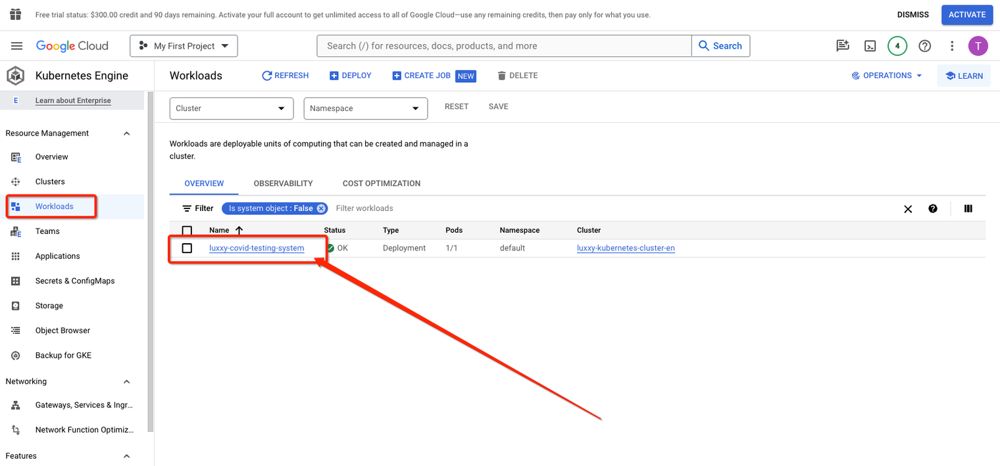
**Step 2**
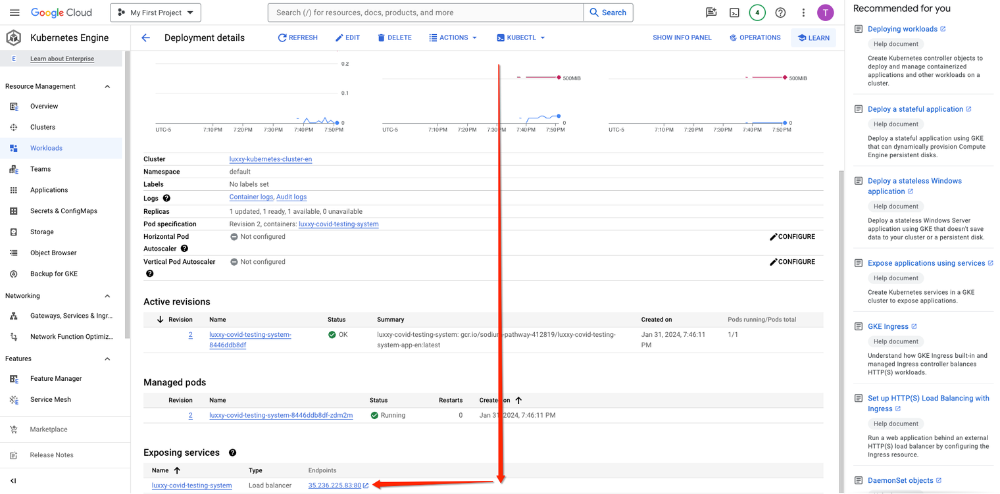

- You should see the app up & running!


- (Optional) Download a sample COVID testing and add an entry in the application.
**Click on the icon below to download the PDF ⬇️**
[covid-testing.pdf](https://prod-files-secure.s3.us-west-2.amazonaws.com/0d1b678b-cd91-4256-93c7-73b2e82396d5/4154a4e6-d3f4-4e33-8720-f97076f19653/covid-testing.pdf)

## Cloud Migration and Database Management

### Steps in Google Cloud Platform (Database Migration)

- Connect to Google Cloud Shell
- **Download** the dump using wget

```bash
cd ~
```

```bash
**wget https://tcb-public-events.s3.amazonaws.com/icp/mission3.zip**
```

```bash
unzip mission3.zip
```

- Connect to MySQL DB running on Cloud SQL (once it prompts for the password, provide welcome123456). Don’t forget to replace the placeholder with your Cloud SQL Public IP

```bash
mysql --host=**<replace_with_public_ip_cloudsql>** --port=3306 -u app -p
```

- Import the dump on Cloud SQL

```bash
use dbcovidtesting;
```

```bash
source ~/mission3/en/db/db_dump.sql
```

- Check if the data got imported correctly  

```bash
select * from records;
```

```bash
exit;
```

### Steps in Amazon Web Services (PDF Files Migration)

- Connect to the AWS Cloud Shell
Download the PDF files

```bash
wget https://tcb-public-events.s3.amazonaws.com/icp/mission3.zip
```

```bash
unzip mission3.zip
```

- Sync PDF Files with your AWS S3 used for COVID-19 Testing Status System. Replace the bucket name with yours.

```bash
cd mission3/en/pdf_files
```

```bash
aws s3 sync . s3://**luxxy-covid-testing-system-pdf-en-xxxx**
```

- Test the application. Upon migrating the data and files, you should be able to see the entries  under “View Guest Results” page.
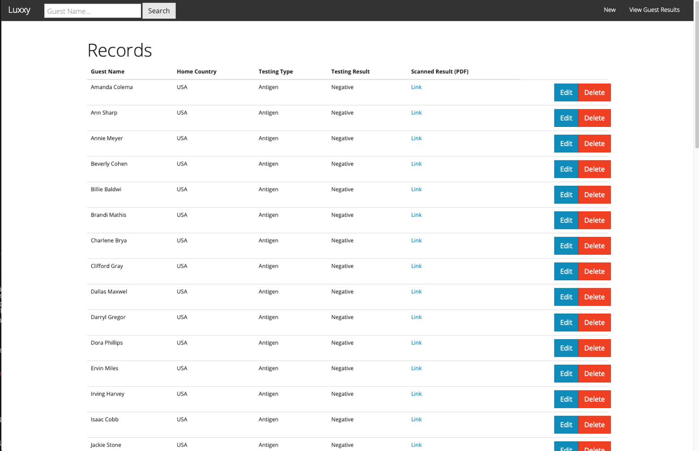

<!-- Congratulations! You have migrated an "on-premises" application & database to a MultiCloud Architecture! -->